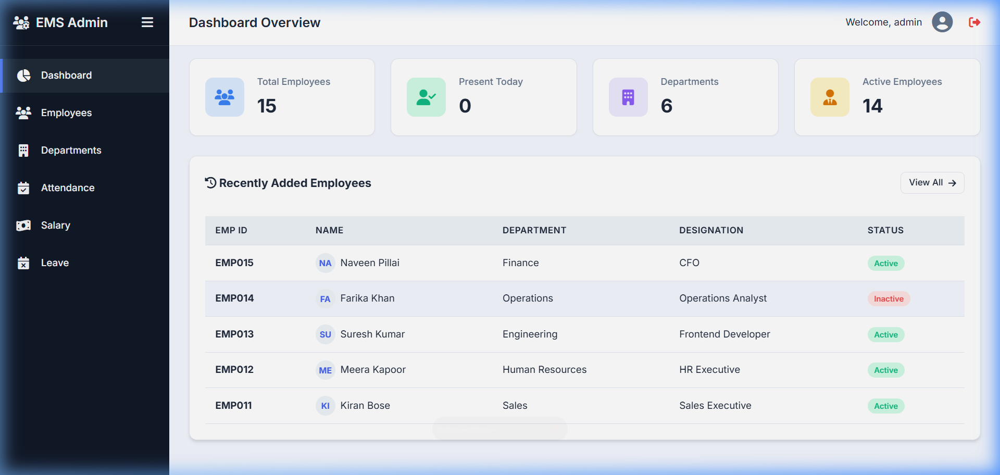
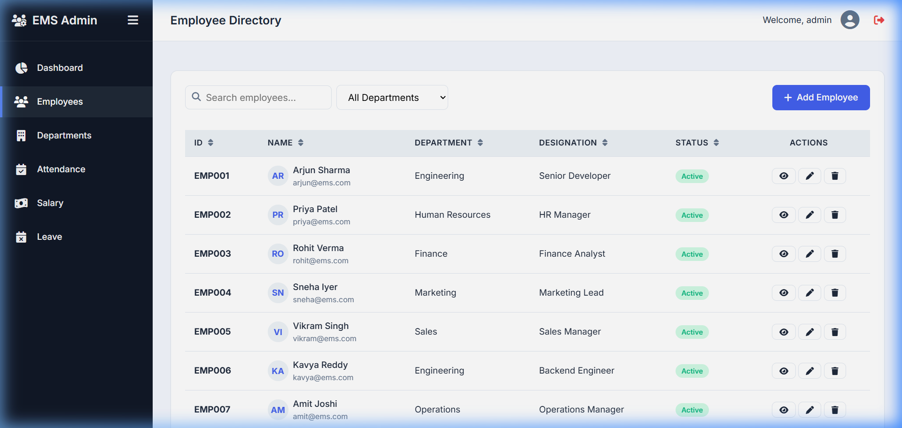
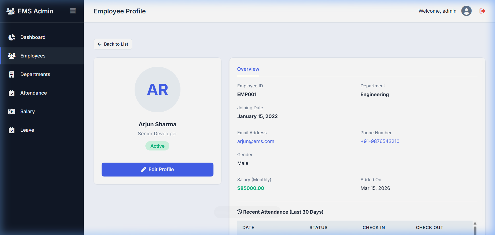

# 🏢 Employee Management System (EMS) - Professional Edition

A high-performance, full-stack web application designed for seamless employee management, attendance tracking, and payroll oversight. This project features a clean, classic, and professional UI built with a modern design system.

---

## 📸 Interactive UI Preview

| **Professional Dashboard** | **Employee Directory** |
|:---:|:---:|
|  |  |
| *Real-time stats & recent updates* | *Advanced search, sort & filters* |

| **Employee Profile** | **Attendance Register** |
|:---:|:---:|
|  | *Detailed attendance tracking per employee* |

---

## 💎 Premium Features

- **Professional Dashboard**: Summary cards for Total Employees, Active Status, Departments, and Daily Attendance.
- **Dynamic Employee Directory**:
  - AJAX-like Search & Department Filtering.
  - Interactive Table Row Sorting (Name, ID, Department).
  - Status Badges (Active/Inactive) & Pagination.
- **Attendance Management**: Mark daily status (Present, Absent, Leave) with check-in/out times.
- **Salary & Payroll**: Automated payroll summary with average salary calculations.
- **Leave Management**: System for viewing and applying for employee leaves.
- **Advanced Admin Panel**: Custom fieldsets, searchable logs, and employee-count aggregations for departments.
- **Seeded Data**: One-command setup with 15 professional employee profiles and sample attendance history.

---

## 🛠️ Tech Stack

- **Backend**: Python 3.12, Django 5.1 (Robust & Scalable)
- **Frontend**: Custom Modern CSS (Vanilla), Inter Typography, FontAwesome 6, Vanilla JavaScript
- **Database**: SQLite3 (Production-ready abstraction for quick setup)
- **Styling**: Responsive Design (Mobile, Tablet, Desktop)

---

## 🚀 Quick Start Guide

### 1. Prerequisites
Ensure you have Python installed.

### 2. Setup
```bash
# Clone the repository
git clone https://github.com/Rupeshkummari/employee-management-system.git
cd employee-management-system/core

# Create virtual environment
python -m venv venv
venv\Scripts\activate  # Windows
```

### 3. Install & Seed
```bash
# Install Django and dependencies
pip install -r ../requirements.txt

# Run migrations and setup professional sample data
python manage.py makemigrations employees
python manage.py migrate
python manage.py seed_data
```

### 4. Run Server
```bash
python manage.py runserver
```

**Visit**: [http://127.0.0.1:8000](http://127.0.0.1:8000)
- **Admin Username**: `admin`
- **Admin Password**: `admin123`

---

## 📁 Project Architecture

- `core/`: Project configuration and settings.
- `employees/`: Primary application logic (Models, Views, URLs).
- `templates/`: Professional HTML structure using Template Inheritance.
- `static/`: Custom CSS/JS and production-ready images.

---

## 👨‍💻 Developed By

**Rupesh K**
- GitHub: [github.com/Rupeshkummari](https://github.com/Rupeshkummari)
- LinkedIn: [linkedin.com/in/kummari-rupesh-76325a251](https://linkedin.com/in/kummari-rupesh-76325a251)
- Email: [rupeshkummari223@gmail.com](mailto:rupeshkummari223@gmail.com)
